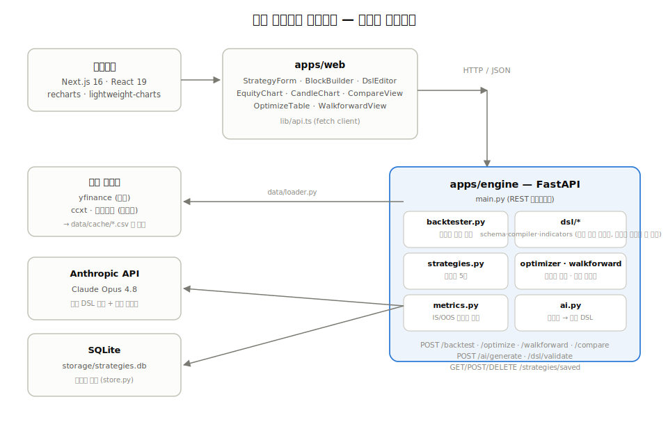

# 퀀트 백테스트 대시보드

[](https://github.com/wjdgnsdl213/quant_backtester/actions/workflows/ci.yml)

주식·크립토 시세에 트레이딩 전략을 적용해 과거 성과를 검증하는 개인용 백테스트 도구입니다.
프리셋 전략, AI 자연어 생성, 블록 조립, JSON 직접 편집까지 — 코드를 몰라도, 알아도 쓸 수 있게 만들었습니다.

## 아키텍처



- **apps/web** (Next.js): 화면과 사용자 입력만 담당. 계산은 하지 않고 엔진 API를 호출한다
- **apps/engine** (FastAPI): 시세 로딩, 전략 컴파일, 백테스트, 최적화, AI 생성을 담당하는 백엔드
- 두 앱은 REST(JSON)로만 통신하며 독립적으로 뜨고 죽는다 (엔진 없이도 웹은 켜지지만 백테스트는 안 됨)

## 주요 기능

- **프리셋 전략 5종** — 이동평균 골든크로스, RSI 과매도 반등, 볼린저밴드 평균회귀, MACD 시그널 교차, 모멘텀 추세추종
- **AI 전략 생성** — 자연어로 설명하면 Claude가 전략 DSL(JSON)을 생성. 생성 결과는 반드시 스키마 검증을 통과해야 실행됨
- **블록 빌더** — 지표를 조합해 나만의 진입/청산 조건 조립 (코드 불필요), 롱/숏 방향 선택 가능
- **숏 포지션** — 커스텀 전략(AI·블록·JSON)은 롱뿐 아니라 숏(공매도)도 지원. 손절/익절 판정 방향이 자동으로 반전됨
- **과적합 진단 (IS/OOS)** — 모든 백테스트를 학습 구간(앞 70%)과 검증 구간(뒤 30%)으로 나눠 평가하고 과적합 위험도를 판정
- **파라미터 최적화** — 프리셋 파라미터 그리드 서치. 학습 구간 기준으로 순위를 매기고 검증 구간 성과를 나란히 표시 (정렬 기준 자체가 검증 구간을 오염시키지 않도록 설계). 최적화 결과는 2D 히트맵으로도 확인 가능
- **워크포워드 분석** — 기간을 여러 폴드로 나눠 매번 "학습 구간에서 재최적화 → 다음 구간에서 검증"을 반복하는, 고정 분할보다 엄밀한 검증
- **몬테카를로 시뮬레이션** — 거래 순서를 수천 번 재배열해 수익률의 신뢰구간과 손실 확률을 추정
- **멀티 심볼 검증** — 같은 전략을 여러 종목에 동시 적용해 특정 종목에만 맞춰진 과적합인지 확인
- **전략 저장·비교** — 마음에 든 전략을 저장하고, 여러 개를 같은 조건으로 한번에 비교
- **고급 모드** — DSL JSON 직접 편집, 최적화 커스텀 그리드, 워크포워드, 몬테카를로, 멀티 심볼, 결과/전략 CSV·JSON 내보내기

## 기술 스택

| | |
|---|---|
| 웹 | Next.js 16, React 19, TypeScript, Tailwind CSS 4, Recharts, lightweight-charts |
| 엔진 | FastAPI, pandas, numpy, Pydantic |
| 시세 | yfinance(주식), ccxt/바이낸스(크립토) — 로컬 CSV 캐시 |
| AI | Anthropic API (Claude Opus 4.8) |
| 저장소 | SQLite (전략 저장) |
| 테스트/CI | pytest, GitHub Actions |

## 시작하기

### 엔진 (백엔드)

```bash
cd apps/engine
python -m venv .venv
.venv\Scripts\activate          # Windows
pip install -r requirements.txt

# AI 전략 생성을 쓰려면 .env 준비 (선택)
cp .env.example .env            # ANTHROPIC_API_KEY 입력

uvicorn main:app --reload --port 8000
```

### 웹 (프론트엔드)

```bash
cd apps/web
npm install
npm run dev
```

`http://localhost:3000` 접속. 엔진(`http://localhost:8000`)이 떠 있어야 백테스트가 동작합니다.

## API 개요 (`apps/engine`)

| 메서드/경로 | 설명 |
|---|---|
| `GET /strategies` | 프리셋 전략 목록 |
| `GET /indicators` | 사용 가능한 지표 스키마 (블록 빌더 · AI 프롬프트용) |
| `POST /backtest` | 프리셋 또는 커스텀 DSL로 백테스트 실행 |
| `POST /optimize` | 파라미터 그리드 서치 (자동/커스텀 그리드) |
| `POST /walkforward` | 워크포워드 분석 (폴드별 재최적화) |
| `POST /compare` | 저장된 전략 여러 개를 동일 조건으로 비교 |
| `POST /ai/generate` | 자연어 → 전략 DSL 생성 |
| `POST /dsl/validate` | DSL 검증 + 요약 (블록 빌더 · JSON 에디터용) |
| `GET/POST/DELETE /strategies/saved` | 전략 저장소 |

## 설계 메모

- **벡터화 여부**: 지표 계산과 자산곡선/수익률 계산은 pandas 벡터 연산(`rolling`, `ewm`, `cumprod`)으로 처리하지만, 포지션 상태 전환(손절/익절 판정)은 순차 상태가 필요해 봉 단위 파이썬 루프로 처리합니다.
- **Look-ahead 방지**: 시그널은 봉 종가 기준으로 계산되고 포지션은 항상 다음 봉부터 반영됩니다.
- **전략 DSL**: AI가 생성하든 블록으로 조립하든 JSON을 직접 쓰든, 실행 전 반드시 동일한 스키마 검증을 통과합니다 — 임의 코드 실행 경로가 없습니다.
- **전략 저장소는 로컬 공용**: 현재 사용자 구분이 없는 단일 SQLite 파일입니다. 개인 로컬 사용을 전제로 하며, 다중 사용자 배포 시에는 인증과 사용자별 저장소가 필요합니다.
